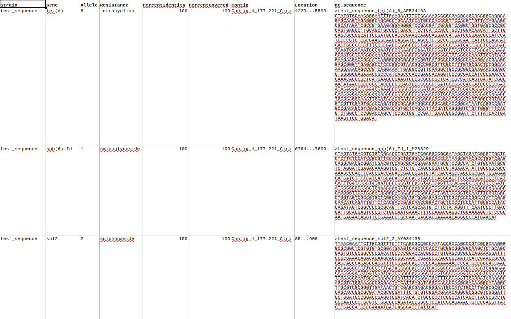
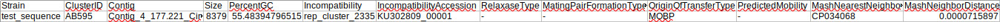
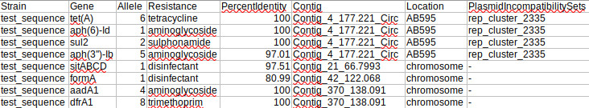

# AMR_Summary

[](https://circleci.com/gh/OLC-Bioinformatics/AMR_Summary/tree/main)
[](https://codecov.io/gh/OLC-Bioinformatics/AMR_Summary)
[](https://anaconda.org/olcbioinformatics/amr_summary)

[](https://github.com/OLC-Bioinformatics/AMR_Summary/issues)
[](https://github.com/OLC-Bioinformatics/AMR_Summary/blob/main/LICENSE)

AMR Summary combines the outputs from [ResFinder](https://cge.cbs.dtu.dk/services/ResFinder/) and [MOB-recon](https://github.com/phac-nml/mob-suite) to yield reports with strain name, gene name, allele, AMR resistance phenotype, percent identity match to the target sequence, contig name, location prediction (plasmid or chromosomal), and plasmid incompatibility sets.

## Installation

AMR_Summary can be installed using conda

Skip this step if you have already installed conda

```
wget https://repo.continuum.io/miniconda/Miniconda3-latest-Linux-x86_64.sh -O miniconda.sh;
bash miniconda.sh -b -p $HOME/miniconda
conda update -q conda
```

### Quickstart

You can now install the AMR_Summary package:

`conda install -c olc-bioinformatics amr_summary`

If you encounter the following error:

`PackageNotFoundError: Packages missing in current channels:`

You need to add one or more of the following channels to your conda install:

- conda-forge
- bioconda
- olcbioinformatics

To see which channels you currently have:

```
conda config --show channels
```

To install the missing channel(s)

```
conda config --append channels olcbioinformatics
conda config --append channels conda-forge
conda config --append channels bioconda
```

### Tests

If you encounter issues with the AMR_Summary package, tests are available to ensure that the installation was successful and your credentials are valid.

You will need to clone this repository and run the tests with pytest:


`git clone https://github.com/OLC-Bioinformatics/AMR_Summary.git`

`cd AMR_Summary`

`python -m pytest tests/ --cov=amr_summary --cov-config=.coveragec -s -vvv`

## Running AMR_Summary
### Arguments

Note that you can supply absolute (e.g. `/home/user/analyses/`), tilde slash (e.g. `~/analyses/`), or relative paths (e.g. `analyses/`) for all path arguments

### Required Arguments

- sequence path: name and path of folder containing sequences to process
- database path: name and path of folder containing ResFinder and MOB-recon databases. Note that you do not need to download these databases; they will be downloaded and initialised as part of the script

### Optional Arguments
- report path: name and path of folder in which reports are to be created. Default is sequence_path/reports
- debug: print debug-level logs to console
- version: print version of AMR_Summary

### Example commands

To process sequence files in FASTA format in the folder `~/Analyses/sequences`, using databases in `/databases`,  and place reports in the `outputs` folder in your current working directory

`AMR_Summary -s ~/Analyses/sequences -d /databases -r outputs`

To process sequences files in FASTA format in the folder `sequences` in your current working directory using databases in `/home/user/databases`, and place reports in the `sequences/reports` folder in your current working directory, and enable debug-level statements

`AMR_Summary -s sequences -d /home/user/databases --debug`

### Usage
```
usage: AMR_Summary [-h] -s  -d  [-r] [--debug] [-v]

AMR Summary: a pipeline to identify AMR resistance genes located on plasmids
by combining ResFinder and MOB-recon

optional arguments:
  -h, --help            show this help message and exit
  -s , --sequence_path 
                        Path of folder containing sequence files in FASTA
                        format to process
  -d , --database_path 
                        Path of folder containing ResFinder and MOB-recon
                        databases. If these databases cannot be located, they
                        will be downloaded
  -r , --report_path    Path of folder in which reports are to be created.
                        Default is sequence_path/reports
  --debug               Enable debug-level messages to be printed to the
                        console
  -v, --version         show program's version number and exit
```

### Outputs

These outputs have been taken from running the supplied [tests](#tests). You can see these outputs in the `tests/outputs` folder if you comment out the final test (`test_clean_outputs`) located in the file `tests/test_amr_summary.py`

Outputs from ResFinder yield basic information on the presence of AMR genes in the supplied sequence files

Below is an excerpt from `resfinder_blastn.xlsx`



Below is the contents of `mob_recon_summary.csv`

MOB-recon reports contain information on plasmids identified in the supplied sequence files



AMR Summary reports combine the ResFinder and MOB-recon reports

Below is the contents of `amr_summary.csv`




### License

MIT License

Copyright (c) 2022 Government of Canada

Permission is hereby granted, free of charge, to any person obtaining a copy of this software and associated documentation files (the "Software"), to deal in the Software without restriction, including without limitation the rights to use, copy, modify, merge, publish, distribute, sublicense, and/or sell copies of the Software, and to permit persons to whom the Software is furnished to do so, subject to the following conditions:

The above copyright notice and this permission notice shall be included in all copies or substantial portions of the Software.

THE SOFTWARE IS PROVIDED "AS IS", WITHOUT WARRANTY OF ANY KIND, EXPRESS OR IMPLIED, INCLUDING BUT NOT LIMITED TO THE WARRANTIES OF MERCHANTABILITY, FITNESS FOR A PARTICULAR PURPOSE AND NONINFRINGEMENT. IN NO EVENT SHALL THE AUTHORS OR COPYRIGHT HOLDERS BE LIABLE FOR ANY CLAIM, DAMAGES OR OTHER LIABILITY, WHETHER IN AN ACTION OF CONTRACT, TORT OR OTHERWISE, ARISING FROM, OUT OF OR IN CONNECTION WITH THE SOFTWARE OR THE USE OR OTHER DEALINGS IN THE SOFTWARE.